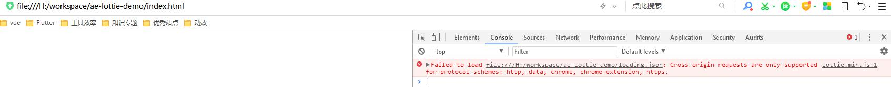
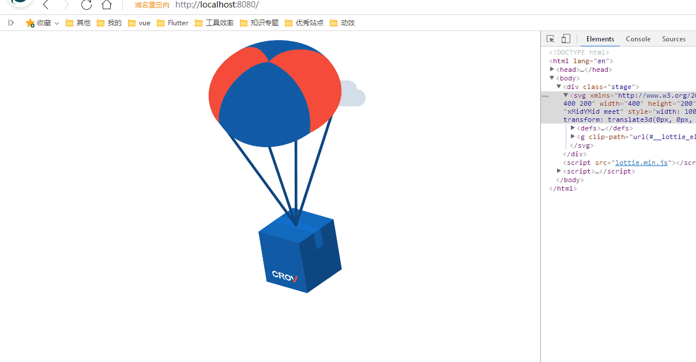

# 怎么在App和Web中使用ae动画
由于前端工程师不熟悉ae，动画师不熟悉前端知识，第一次可能不知道怎么整合，这里做个简单介绍。

简言之就是用ae的插件[Bodymovin](https://www.adobeexchange.com/creativecloud.details.12557.html)导出动画的json数据，然后用[Lottie](http://airbnb.io/lottie/#/README)动画库在页面中调用。

## Bodymovin安装
1. 方法一在Adobe插件中心下载安装[Bodymovin](https://www.adobeexchange.com/creativecloud.details.12557.html)
2. 方法二直接下载源文件[bodymovin.zxp](https://github.com/airbnb/lottie-web/tree/master/build/extension)用[ZXP Installer](https://aescripts.com/learn/zxp-installer/)安装。

详细步骤请参考[https://www.cnblogs.com/zamhown/p/6688369.html](https://www.cnblogs.com/zamhown/p/6688369.html)

## web页面使用
```html
    <div class="stage"></div>
    <script src="lottie.min.js"></script>
    <script>
    var stage = document.querySelector('.stage');
    var anim = lottie.loadAnimation({
        container: stage,   //包含动画的DOM元素
        renderer: 'svg',  // 'svg' / 'canvas' / 'html'
        loop: false, //true / false / number
        autoplay: true, //true / false
        path: 'loading.json',   //动画的路径
    });
    anim.addEventListener('complete', function(){
        console.log('complete:' + Date.now());
        anim.destroy();
    })
    </script>
```
## 查看
如果直接本地打开，应该看不了，会提示如下错误：

因此需要本地简单起个http服务才能查看，可以简单装个http-server：
```shell
npm i http-server -g
cd ae-lottie-demo
http-server
```
http服务启动好了就可以访问http://localhost:8080/看下效果了。


## 其他 
lottie也支持Android, iOS, React Native, and Windows端使用，具体请移步[官方文档](http://airbnb.io/lottie/#/README)。